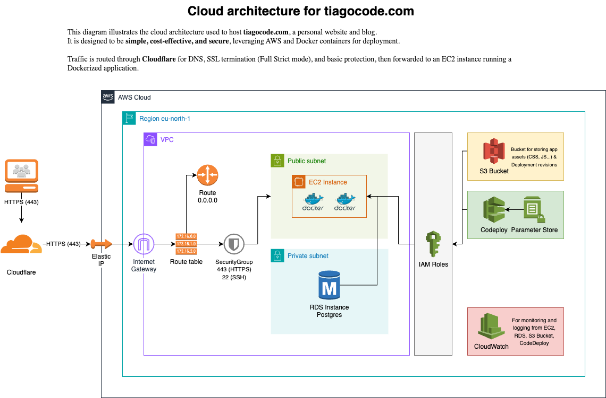

# Tiagocode.com – Cloud Architecture

This repository contains the infrastructure diagram and setup details for hosting [tiagocode.com](https://website.tiagocode.com), a personal blog and portfolio site.

## Overview

- ✅ Hosted on **AWS EC2** with a **Dockerized** application
- ✅ Fronted by **Cloudflare** for HTTPS, DNS, and protection
- ✅ Logs and metrics sent to **CloudWatch**
- ✅ Assets and backups stored in **S3**
- ✅ Access and permissions managed via **IAM roles**
- ✅ Secured by a **Security Group** allowing only `443 (HTTPS)` and `22 (SSH)`

> Designed to be lightweight, secure, and cost-effective — perfect for personal or low-traffic projects.

## Diagram

